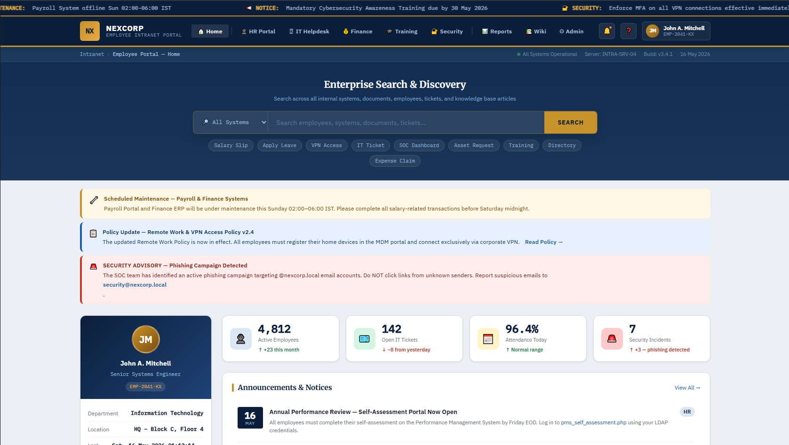
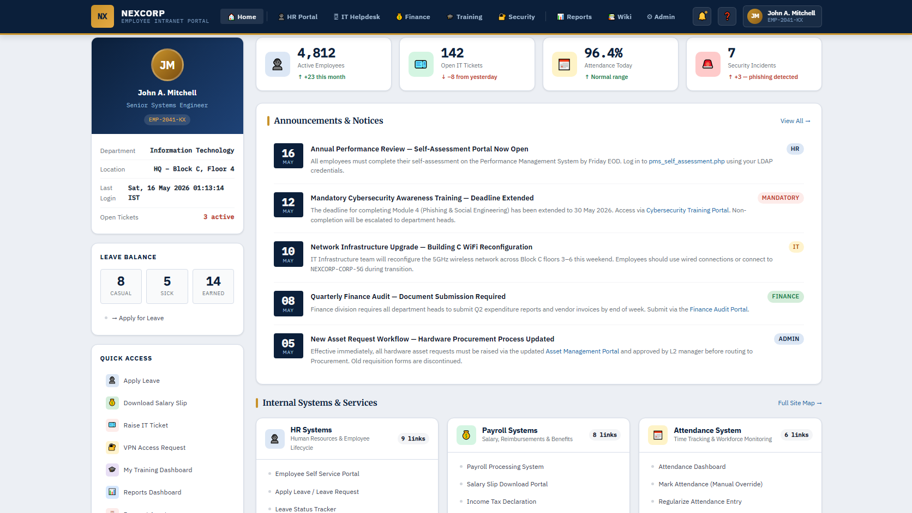
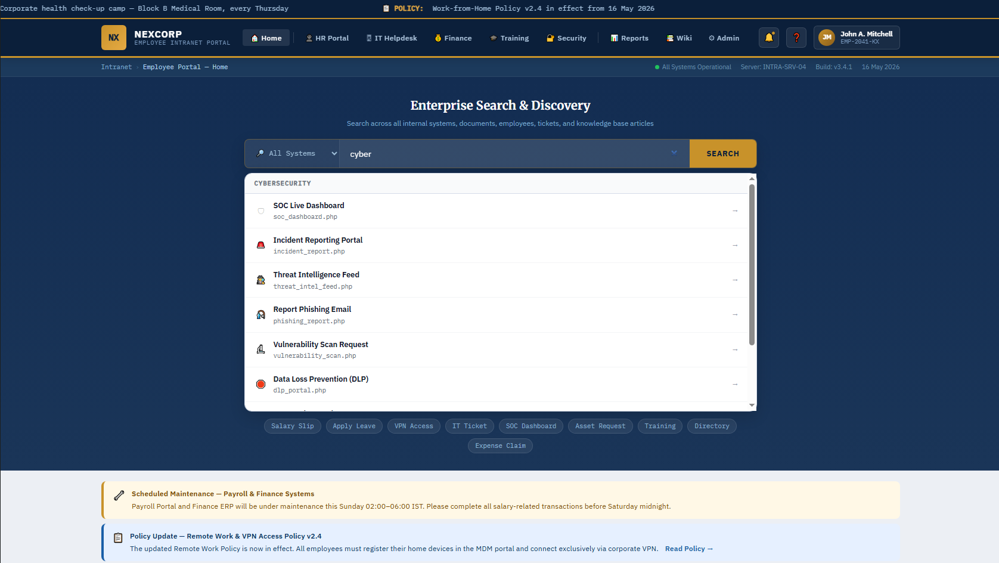
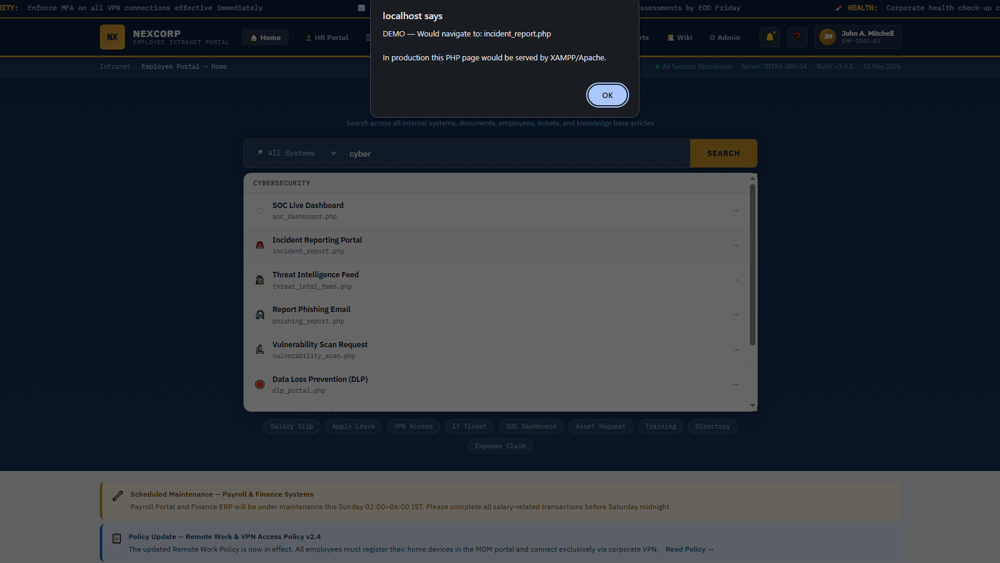
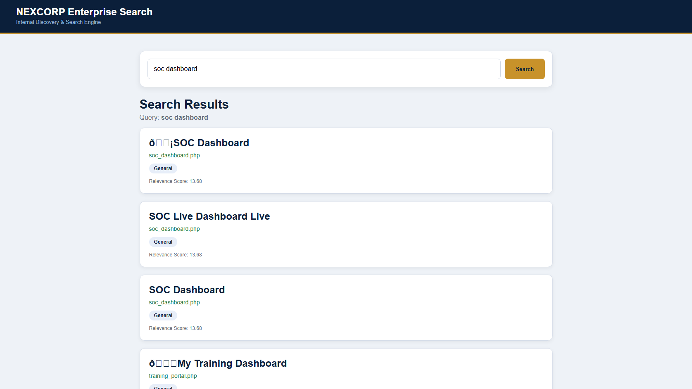
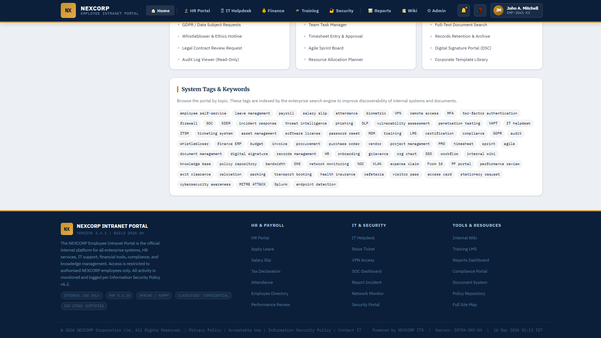

# 🛡️ IIRS: Intelligent Intranet Retrieval System

[]()
[]()
[]()
[]()

> **A lightweight, air-gapped enterprise search engine designed for internal corporate discovery.**
>
> IIRS simulates a dedicated internal search portal, allowing users to instantly locate enterprise services, dashboards, and organizational resources. Built with a custom crawler and metadata-based indexing, it provides rapid, categorized discovery while running completely offline — making it ideal for isolated lab environments, internal network experimentation, and SOC infrastructure simulations.

---

# ✨ Core Features

- 🔍 Intelligent intranet search using MySQL FULLTEXT indexing
- 🕷️ Automated crawler & metadata indexer
- ⚡ Live portal filtering and instant search experience
- 🏢 Enterprise dashboard-style UI
- 📂 Categorized internal service discovery
- 💾 Lightweight searchable index database
- 🌐 100% offline / air-gapped deployment
- 🖥️ XAMPP compatible setup

---

# 🗺️ System Architecture

```text
                +----------------------+
                |      Employee        |
                +----------+-----------+
                           |
                           v
                +----------------------+
                |      portal.php      |
                | Enterprise Dashboard |
                +----------+-----------+
                           |
                           v
                +----------------------+
                |  search_backend.php  |
                |     Search Engine    |
                +----------+-----------+
                           |
                           v
                +----------------------+
                | MySQL FULLTEXT Index |
                +----------+-----------+
                           ^
                           |
                +----------------------+
                |     crawler.php      |
                | Metadata Indexer     |
                +----------+-----------+
                           |
                           v
                +----------------------+
                |      portal.php      |
                | Extract Metadata     |
                +----------------------+
```

---

# 🛠️ Technology Stack

| Category | Technologies |
|---|---|
| Frontend | HTML5, CSS3, JavaScript |
| Backend | PHP 8.x |
| Database | MySQL / MariaDB |
| Search Engine | MySQL FULLTEXT |
| Environment | XAMPP |
| UI Design | Enterprise Dashboard UI |

---

# 📁 Project Structure

```text
iirs/
├── portal.php
├── crawler.php
├── search_backend.php
├── db.php
├── schema.sql
└── README.md
```

---

# 🚀 Installation & Setup (Windows + XAMPP)

## 1. Install XAMPP

Download and install XAMPP:

https://www.apachefriends.org/index.html

Start:
- Apache
- MySQL

from the XAMPP Control Panel.

---

# 2. Move Project Folder

Copy the `iirs` folder into:

```text
C:\xampp\htdocs\
```

Final path:

```text
C:\xampp\htdocs\iirs\
```

---

# 3. Create Database

Open browser:

```text
http://localhost/phpmyadmin
```

Create database:

```sql
CREATE DATABASE intranet_search;
```

---

# 4. Import Database Schema

Select:
```text
intranet_search
```

Click:
```text
SQL
```

Run:

```sql
USE intranet_search;

CREATE TABLE search_index (

    id INT AUTO_INCREMENT PRIMARY KEY,

    title VARCHAR(255),

    url VARCHAR(255),

    category VARCHAR(100),

    keywords TEXT,

    content TEXT

);

ALTER TABLE search_index
ADD FULLTEXT(title, keywords, content);
```

---

# 5. Configure Database Connection

Open:

```text
db.php
```

Verify credentials:

```php
<?php

$conn = new mysqli(
    "localhost",
    "root",
    "",
    "intranet_search"
);

if($conn->connect_error){
    die("Database Connection Failed");
}

?>
```
# 🖼️ Application Preview

## 🖥️ Enterprise Portal Dashboard



---

## 🏢 Internal Systems & Services



---

## 🔎 Enterprise Search & Discovery



---

## 📂 Indexed Search Results



---

## 🚀 Portal Navigation Simulation



---

## 🏷️ Indexed Keywords & Metadata


---

# 6. Run the Crawler

Before searching, build the index by opening:

```text
http://localhost/iirs/crawler.php
```

This will:
- Parse portal services
- Extract searchable metadata
- Categorize resources
- Populate MySQL index

---

# 7. Launch the Portal

Open:

```text
http://localhost/iirs/portal.php
```

Try searching:
- VPN
- HR
- Payroll
- SOC
- Security
- Tickets
- Internal Systems

---

# 🔎 Search Flow

```text
User Search
     ↓
Portal Search UI
     ↓
Search Backend
     ↓
MySQL FULLTEXT Search
     ↓
Ranked Search Results
```

---

# 🕷️ Crawler Workflow

```text
portal.php
    ↓
Extract Links & Metadata
    ↓
Categorize Services
    ↓
Store Indexed Records
    ↓
MySQL FULLTEXT Database
```

---

# 🔒 Security Posture

- SQL Injection protection using prepared statements
- Fully local/offline architecture
- No external APIs or CDN dependencies
- Designed for isolated enterprise/lab environments

---

# 🚧 Future Enhancements

- [ ] AJAX live search
- [ ] Role-Based Access Control (RBAC)
- [ ] Search analytics dashboard
- [ ] Typo-tolerant search
- [ ] Elasticsearch integration
- [ ] Semantic ranking engine
- [ ] Real recursive crawler engine

---

# 📄 MIT License

MIT License

Copyright (c) 2026 IIRS

---

# 👨‍💻 Author

Built using:
- PHP
- MySQL
- JavaScript
- XAMPP

---

*Built for Enterprise Infrastructure & Internal Discovery Systems*
